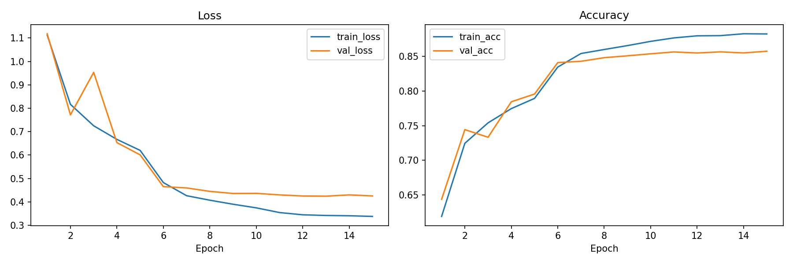
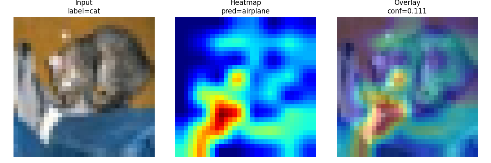

# CIFAR-10 Image Classification with CNN & ResNet (PyTorch)

## 📌 Overview

This project implements an end-to-end deep learning pipeline for image classification on the CIFAR-10 dataset using PyTorch.

The goal was not only to train models, but to:
- Build a clean and modular training pipeline
- Apply transfer learning with ResNet
- Improve performance through systematic experimentation
- Analyze model behavior using interpretability techniques (Grad-CAM)

---

## 📂 Dataset

- **Dataset**: CIFAR-10
- **Classes**: airplane, automobile, bird, cat, deer, dog, frog, horse, ship, truck
- **Images**: 60,000 (50k train / 10k test)
- **Resolution**: 32×32 RGB

---

## 🧠 Models

### 1. Simple CNN (Baseline)
- Custom convolutional neural network
- Used to establish a baseline performance

### 2. ResNet18 (Transfer Learning)
- Pretrained ResNet18 backbone
- Final fully connected layer adapted to 10 classes
- Backbone optionally frozen/unfrozen

---

## ⚙️ Training Pipeline

The project includes a full training pipeline:

- Data loading with `torchvision`
- Data augmentation:
  - Random crop (padding=4)
  - Random horizontal flip
- Normalization using CIFAR-10 statistics
- Loss: CrossEntropyLoss
- Optimizer: Adam + weight decay
- Learning rate scheduler (StepLR)
- Checkpointing (best + latest models)
- Training history logging (CSV + JSON)
- Visualization of training curves

---

## 📊 Results

| Model | Setup | Accuracy |
|------|------|--------|
| CNN | baseline | ~68% |
| ResNet18 | unfrozen | ~82% |
| ResNet18 | + augmentation + weight decay + scheduler | **86%** |

---

## 📈 Training Behavior

- Training and validation curves show stable convergence
- Reduced overfitting after adding augmentation and regularization
- Validation accuracy plateaued around **85–86%**

---

## 🔍 Evaluation

Evaluation includes:
- Precision / Recall / F1-score per class
- Confusion matrix
- Saved evaluation reports in JSON

Key observations:
- Strong performance on structured classes (automobile, ship, truck)
- Most confusion occurs between:
  - **cat ↔ dog**
  - **bird ↔ deer**

---

## 🔥 Model Interpretability (Grad-CAM)

Grad-CAM was used to visualize what the model focuses on during predictions.

Key insights:
- Correct predictions: model attends to object regions
- Misclassifications: attention often shifts to background or irrelevant textures
- Cat vs dog confusion is visually explainable

This step helped move beyond training into **understanding model behavior**.

---

## 🗂️ Project Structure
```
deep-learning-instructor-labs/
│
├── data/
│ ├── raw/
│ 
│
├── notebooks/
│ ├── 01_intro_to_cnn.ipynb
│ ├── 02_training_pipeline.ipynb
│ ├── 03_transfer_learning.ipynb
│ ├── 04_model_debugging.ipynb
│ └── 05_gradcam_visualization.ipynb
│
├── results/
│ ├── models/
│ ├── logs/
│ └── plots/
│
├── src/
│ ├── data_loader.py
│ ├── model_cnn.py
│ ├── model_resnet.py
│ ├── train.py
│ ├── evaluate.py
│ ├── gradcam.py
│ └── utils.py
│
└── README.md

```
---

## 🚀 How to Run

### 1. Install dependencies

```bash
python -m venv venv
venv\Scripts\activate
pip install -r requirements.txt
```

2. Train the model
```bash
python src/train.py --model resnet --epochs 15 --batch-size 64 --lr 0.001
```
3. Evaluate the model
```bash
python src/evaluate.py --model-path results/models/resnet_best.pt
```
3. Streamlit demo
```bash
streamlit run demos/streamlit_app.py
```
## 📷 Visual Results

### Training Curve


### Grad-CAM Examples


## 🎥 Demo


📌 Key Learnings

Data augmentation significantly improves generalization

Regularization (weight decay) improves stability, not always raw accuracy

Transfer learning with ResNet provides strong performance even on small images

Model evaluation requires more than accuracy (F1, confusion matrix)

Interpretability (Grad-CAM) is essential for understanding model decisions

📎 Conclusion

This project demonstrates a complete deep learning workflow:

From baseline model → optimized architecture

From training → evaluation → interpretation
